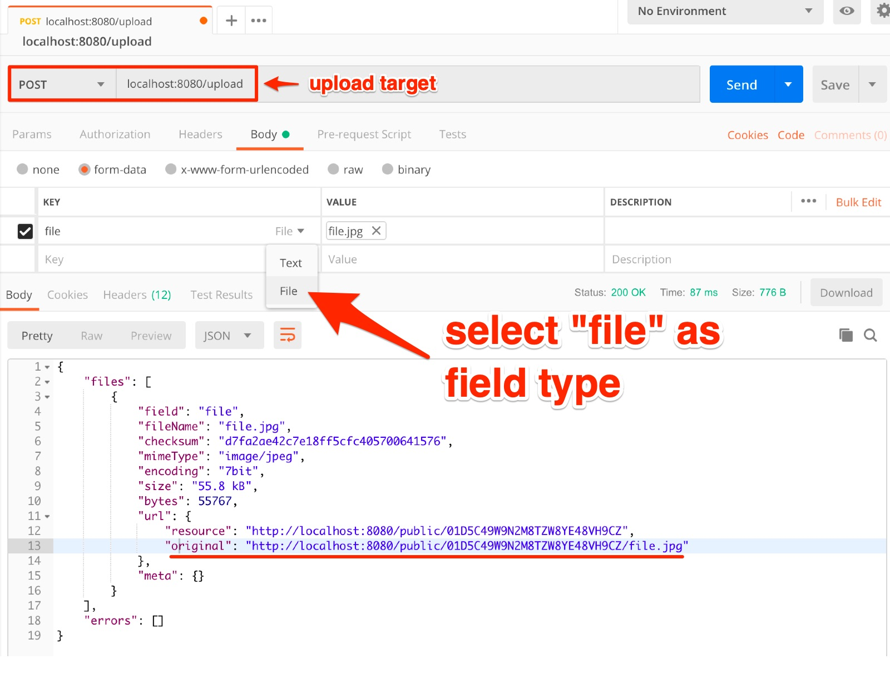

# Upload into Stuffer

Uploads are handled by sending a `multipart/form-data` _POST_ request to the 
`/upload` endpoint. You can send multiple files at the time.

The minimum requisite is a field file:

    fieldName: f1
    fieldType: file

You can perform an upload via CURL:

    curl -X POST http://localhost:8080/upload \
        -F f1_uuid=f1 \
        -F f1_name=image.jpg \
        -F f1=@/Users/marcopeg/Downloads/file.jpg

Or you can use a UI tool like [postman](https://www.getpostman.com):

## Expected Output

The `/upload` endpoint returns a list of `files` that have been succesfully uploaded,
and a list of `errors` that might have happened along the way.

Here is an example of a standard response body:

    {
        "files": [
            {
                "field": "file",
                "fileName": "file.jpg",
                "checksum": "d7fa2ae42c7e18ff5cfc405700641576",
                "type": "image/jpeg",
                "encoding": "7bit",
                "size": "55.8 kB",
                "bytes": 55767,
                "url": {
                    "resource": "http://localhost:8080/public/01D5C49W9N2M8TZW8YE48VH9CZ",
                    "original": "http://localhost:8080/public/01D5C49W9N2M8TZW8YE48VH9CZ/file.jpg"
                },
                "meta": {}
            }
        ],
        "errors": [
            {
                "type": "file",
                "success": false,
                "field": "f1",
                "fileName": "elisa.txt",
                "uuid": "f1",
                "space": "public",
                "encoding": "7bit",
                "mimeType": "text/plain",
                "bytesReceived": 1340,
                "bytesWritten": 1340,
                "tempPath": "/Users/marcopeg/dev/marcopeg/stuffer/data/stuffer/uploads/2019-02-17/public__f1__elisa.txt",
                "metaPath": null,
                "errors": [
                    {
                        "type": "checksum",
                        "message": "checksum validation failed",
                        "details": null
                    }
                ],
                "deleted": true
            }
        ]
    }

## Handling Errors

As you can see the `errors` list refers to the files tha failed to upload.

Inside each file data there is the `errors` list that contains informations about what
went wrong with that specific file.

## File Url

The resulting URL of the file is a combination of:

    {baseUrl}/{space}/{uuid}/{fileName}

## Upload Space

The **file space** depends on the authenticated user.

You can control this information with the header `Authentication` with content `Bearer xxx`
where the `xxx` is your account's secret token. [Read more about authentication](./authentication.md)

If no authentication is provided and the anonymous upload feature is active, the
uploads end up in a `public` space. You can control the actual name by setting an
environment variable:

    UPLOAD_PUBLIC_SPACE=custom-value

## Upload UUID

Each file that you upload is provided with a randomly generated universal unique id. 
If you try to upload the same file twice, you will generate multiple copies of it.

> If you run Stuffer with `NODE_ENV=development` the _uuid_ will be generated out of
> the file name so to avoid to create thousands of files. It's an intended development
> behaviour and you should familiarize with the differences in production.

If you explicitly want to override a previously uploaded file you can provide a
**custom UUID** using a form field named: `{uploadField}_uuid`.

    fileField: f1           bynary...
    uuidField: f1_uuid      myCustomId

**NOTE:** a custom id is strictly alphanumeric and can not contain spaces.

You may need this feature in 2 scenarios:

- you need to calculate the file url before the upload happens, hence you can not
  rely on automatically generated ids
- you explicitly want to override a previously uploaded file. In this case be careful
  to send the very same file name or orphan files may generates in your storage

**NOTE:** During development the automatically generated uuid equals to the file name.
This is intended to generate fewer upload folders and make your life easier :-)

## Upload Name

You can rename a file while uploading it by passing a `{uploadField}_name` field
containing the desired name.

A custom name should only contain `a-zA-Z-_`. No spaces or non standard characters are
allowed for compatibility reasons.

## Upload Checksum

In order to verify a correct upload you can provide an optional `md5` checksum of the
file as custom field name `{uploadField}_checksum`.

When this information is provided, it will be checked as post-upload validation step.
In case the validation fails, the file will be marked ad error and deleted from the
storage layer.

## Upload Meta Data

You can provide a JSON meta data object as custom field `{uploadField}_meta`. Consider
this some kind of "cookies for uploads".

In this file you can provide informations that can be used at download time.

As example you could provide a list of accepted resize requests, so that when somebody
tries to download you resized image, a validation can take place.

Anyway, the informations that you provide in this field depends a lot on the 
[**upload and download modifiers**](./modifiers.md) that you setup in your stuffer instance.

